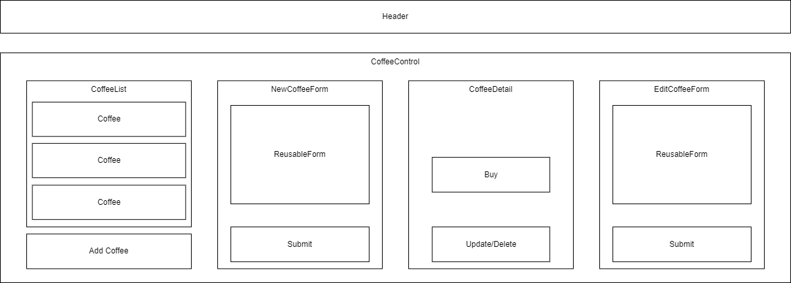

# Coffee Shop

#### An inventory tracker for a coffee shop.

#### By Aidan Williams

## Technologies Used

* _HTML_
* _CSS_
* _Javascript_
* _Node Package Manager_
* _webpack_
* _ESLint_
* _Jest_
* _Babel_
* _React_

## Description

A website where users can list coffees offered at a shop. Includes functionality to add, edit, delete, and sell a type of coffee.

## Setup/Installation Requirements

* _Clone this repository to your desktop._
* _Run the following commands in the top level of the directory._
  * _`$ npm install` to install packages_
  * _`$ npm run build` to build the project using webpack_
* _Open dist/index.html in your browser._

* Other commands:
  * _To build the project and start a development server, run `$ npm run start`._
  * _To lint Javascript files, run `$ npm run lint`._
  * _To view code testing with Jest, run `$ npm run test`._

## Known Bugs

* _No known bugs._

## License

_[GPL](https://en.wikipedia.org/wiki/GNU_General_Public_License)_

Copyright (c) _2024_ _Aidan Williams_